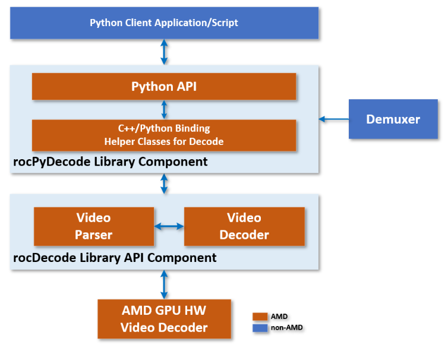

.. meta::
  :description: rocPyDecode API documentation
  :keywords: rocPyDecode, rocDecode, ROCm, API, documentation, video, decode, decoding, acceleration

**********************
rocPyDecode Python API
**********************

The rocPyDecode API is a ROCm rocDecode Python/C++ Binding, a tool that lets you access rocDecode APIs in both Python and C/C++ languages. It works by connecting Python and C/C++ libraries, enabling function calling and data passing between the two languages. The ``rocpydecode`` library is a wrapper API that uses the rocDecode C/C++ language APIs within a Python wrapper.

The rocPyDecode API main classes are a decoder class and a demuxer class. All rocPyDecode APIs are exposed using the API files ``decoder.py`` and ``demuxer.py``. You can find these files in the `pyRocVideoDecode <https://github.com/ROCm/rocPyDecode/blob/develop/pyRocVideoDecode>`_ folder in the rocPyDecode github repository. The demuxer.py class is a python class that binds to the C++ class PyVideoDemuxer, and the decoder.py class binds to the C++ PyRocVideoDecoder class. The class names are differentiated to help distinguish between the Python and C++ classes.

The decoder class
==================

The decoder class contains member API functions used to decode video frames.

* :doc:`Decoder Class <decoderClass>`

The demuxer class
==================

The demuxer class contains API functions used to demux input video frames before decoding them.

* :doc:`Demuxer Class <demuxerClass>`

rocPyDecode Structures
=======================

The rocPyDecode generic structures described here are used in some decode or demuxer API calls to set, get or retrieve related elements.  

* :doc:`Structures <structures>`

API Functions and Features
===========================
- **Parser Support:**
  Yes
- **Feature:**
  Decoding
- **Codec:**
  H.264, HEVC - 8/10 bit
- **Format Conversion:**
  GPU color space & pixel format conversions
- **Exporting GPU MEM:**
  Yes (no copies between host & device)
- **OS:**
  Linux
- **Scaling Support:**
  Yes using HIP kernels
- **Resolution:**
  4K for H.264, 8K for HEVC 

rocPyDecode API Usage Examples
==============================

Examples of how to use the rocPyDecode API classes and functions can be found at `rocPyDecode/samples <https://github.com/ROCm/rocPyDecode/tree/develop/samples>`_.
