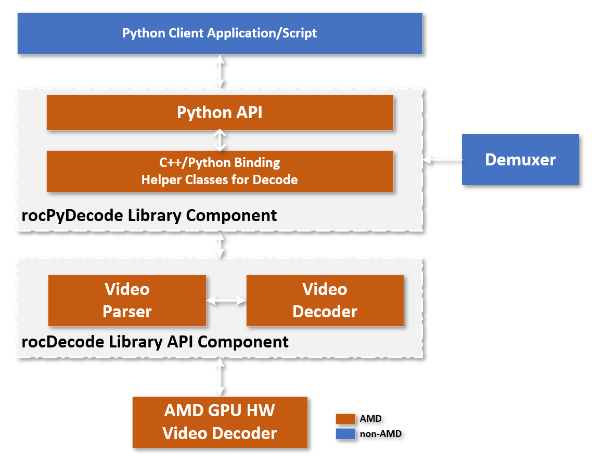

.. image:: https://img.shields.io/badge/license-MIT-blue.svg
    :target: https://opensource.org/licenses/MIT

**rocPyDecode** Python API
==========================

The rocPyDecode API is a ROCm rocDecode Python/C++ Binding, a tool that allows users to access rocDecode APIs in both Python and C/C++ languages. It works by connecting Python and C/C++ libraries, enabling function calling and data passing between the two languages. The *rocpydecode* library is a wrapper API that facilitates the use of rocDecode APIs that are written primarily in C/C++ language within Python.

The rocPyDecode API main classes are a decoder class and a demuxer class. 

The decoder class
=================

The decoder class contains all the decoder member API functions the developers need to decode a video frames.

* :doc:`rocPyDecode Class <deCoderClass>`

The demuxer class
=================

The demuxer class contains all needed demuxing API functions to demux the input video before decoding it.

* :doc:`Demuxer Class <deMuxerClass>`

rocPyDecode Structures
======================

The rocPyDecode generic structures are used in some API calls to set, get or retrieve related elements.  

* :doc:`Structures Classess <structures>`

rocPyDecode API Architecture
============================

API Functions and Features
==========================
- **Parser Support:**
  Yes
- **Feature:**
  Decoding
- **Codec:**
  H.264, HEVC - 8/10 bit
- **Format Conversion:**
  GPU color space & pixel format conversions
- **Exporting GPU MEM:**
  Yes (no copies between host & device)
- **OS:**
  Linux
- **Scaling Support:**
  Yes using HIP kernels
- **Resolution:**
  4K for H.264, 8K for HEVC 

API Usage Python Sample Code
============================

An example of how to use the ***rocPyDecode*** APIs classes and functions can be found at `GitHub <https://github.com/ROCm/rocPyDecode/tree/develop/samples>`_
