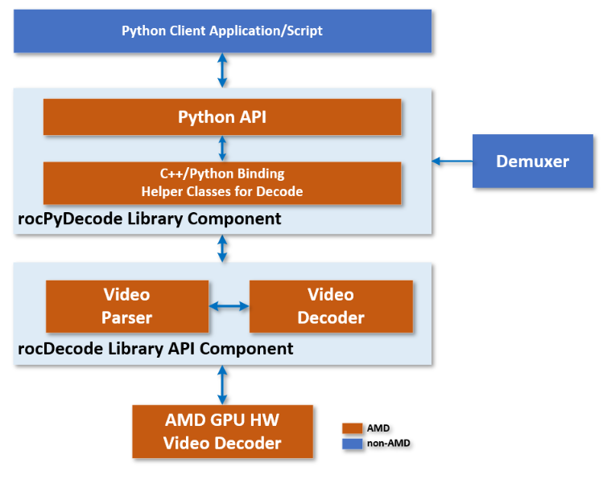

.. meta::
  :description: rocPyDecode API documentation
  :keywords: rocPyDecode, rocDecode, ROCm, API, documentation, video, decode, decoding, acceleration

**********************
rocPyDecode Python API
**********************

The rocPyDecode API is a ROCm rocDecode Python/C++ Binding, a tool that lets you access rocDecode APIs in both Python and C/C++ languages. It works by connecting Python and C/C++ libraries, enabling function calling and data passing between the two languages. The ``rocpydecode`` library is a wrapper API that uses the rocDecode C/C++ language APIs within a Python wrapper.

The rocPyDecode API main classes are a decoder class and a demuxer class. All rocPyDecode APIs are exposed using the API files ``decoder.py`` and ``demuxer.py``. You can find these files in the ``pyRocVideoDecode`` directory. The demuxer.py class uses PyAV to supply compressed packets. The decoder.py class binds to the C++ PyRocVideoDecoder GPU class, while decodercpu.py uses PyAV for software decoding.

Demuxing and CPU decoding
=========================

Demuxing and CPU decoding require PyAV. The ``rocpydecode.PyVideoDemuxer``,
``PyFileStreamProvider`` and ``PyRocVideoDecoderCpu`` entry points are also
available. Unsupported codec names or IDs raise ``ValueError``. Raw-stream GPU
decoding does not require PyAV.

CPU decoding supports host-copied and device-copied YUV outputs.
RGB conversion and resizing use HIP and therefore
require an AMD GPU even when the compressed stream is decoded on the CPU.
Exported tensors retain their frame allocations. CPU decode calls on the same
instance are serialized. Create a new CPU decoder after end of stream.

For CPU decoding, use ``b_force_zero_latency=False`` and
``max_width=max_height=0``. Frame dimensions follow the input stream; requesting
forced zero latency or nonzero maximum dimensions raises ``ValueError``.
The ``PyRocVideoDecoderCpu`` entry point names the latency option
``force_zero_latency``. These restrictions do not apply to the GPU decoder.

Seeking supports modes 0 (exact packet) and 1 (previous keyframe), and criteria 0
(frame number at a known constant rate) and 1 (timestamp in seconds). Packet
presentation timestamps use milliseconds for the default decoder clock. Exact
packet seeking does not supply missing reference frames; begin at a preceding
keyframe when decoding inter-predicted video. Reset/recreate the decoder when
seeking to a different position. Input and seek failures raise exceptions.

The memory stream provider accepts writable buffer objects in ``GetData``.
The demuxer's ``close()`` or
context-manager interface releases its container; subsequent reads and seeks
raise ``ValueError``. Caller-supplied file-like objects remain owned by the
caller and should be closed separately, for example with their own ``with`` block.

The decoder class
==================

The decoder class contains member API functions used to decode video frames.

* :doc:`Decoder Class <decoderClass>`

The demuxer class
==================

The demuxer class contains API functions used to demux input video frames before decoding them.

* :doc:`Demuxer Class <demuxerClass>`

rocPyDecode Structures
=======================

The rocPyDecode generic structures described here are used in some decode or demuxer API calls to set, get or retrieve related elements.  

* :doc:`Structures <structures>`

API Functions and Features
===========================
- **Parser Support:**
  Yes
- **Feature:**
  Decoding
- **Codec:**
  H.264, HEVC - 8/10 bit
- **Format Conversion:**
  GPU color space & pixel format conversions
- **Exporting GPU MEM:**
  Yes (no copies between host & device)
- **OS:**
  Linux
- **Scaling Support:**
  Yes using HIP kernels
- **Resolution:**
  4K for H.264, 8K for HEVC 

rocPyDecode API Usage Examples
==============================

Examples of how to use the rocPyDecode API classes and functions can be found under ``samples/rocdecode``.
